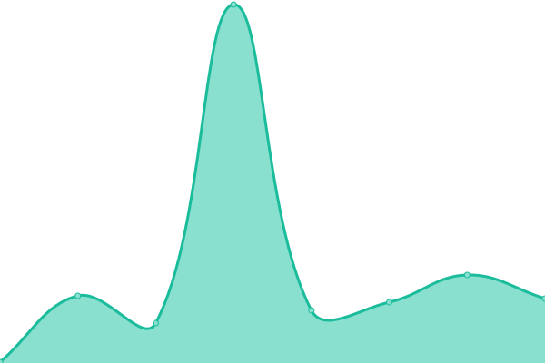

# [📈 Live Status](https://GeekCornerGH.github.io/helios-status-page): <!--live status--> **🟩 All systems operational**

This repository contains the open-source uptime monitor and status page for [GeekCorner](https://ytgeek.gq), powered by [Upptime](https://github.com/upptime/upptime).

With [Upptime](https://upptime.js.org), you can get your own unlimited and free uptime monitor and status page, powered entirely by a GitHub repository. We use [Issues](https://github.com/GeekCornerGH/helios-status-page/issues) as incident reports, [Actions](https://github.com/GeekCornerGH/helios-status-page/actions) as uptime monitors, and [Pages](https://GeekCornerGH.github.io/helios-status-page) for the status page.

<!--start: status pages-->
<!-- This summary is generated by Upptime (https://github.com/upptime/upptime) -->
<!-- Do not edit this manually, your changes will be overwritten -->
<!-- prettier-ignore -->
| URL | Status | History | Response Time | Uptime |
| --- | ------ | ------- | ------------- | ------ |
|  [Mojang Multiplayer Session Service](http://session.minecraft.net) | 🟩 Up | [mojang-multiplayer-session-service.yml](https://github.com/AventiumSoftworks/helios-status-page/commits/HEAD/history/mojang-multiplayer-session-service.yml) | 

 143ms
     
 | 

<a href="https://AventiumSoftworks.github.io/helios-status-page/history/mojang-multiplayer-session-service">97.30%</a>
    

|  [Minecraft Skins](https://textures.minecraft.net) | 🟩 Up | [minecraft-skins.yml](https://github.com/AventiumSoftworks/helios-status-page/commits/HEAD/history/minecraft-skins.yml) | 

 1102ms
     
 | 

<a href="https://AventiumSoftworks.github.io/helios-status-page/history/minecraft-skins">97.06%</a>
    

|  [Mojang's Public API](https://api.mojang.com/) | 🟩 Up | [mojang-s-public-api.yml](https://github.com/AventiumSoftworks/helios-status-page/commits/HEAD/history/mojang-s-public-api.yml) | 

 538ms
     
 | 

<a href="https://AventiumSoftworks.github.io/helios-status-page/history/mojang-s-public-api">96.52%</a>
    

|  [Mojang Accounts Website](https://account.mojang.com/login) | 🟩 Up | [mojang-accounts-website.yml](https://github.com/AventiumSoftworks/helios-status-page/commits/HEAD/history/mojang-accounts-website.yml) | 

 465ms
     
 | 

<a href="https://AventiumSoftworks.github.io/helios-status-page/history/mojang-accounts-website">100.00%</a>
    

|  [Microsoft OAuth Server](https://login.microsoftonline.com/consumers/oauth2/v2.0/token) | 🟩 Up | [microsoft-o-auth-server.yml](https://github.com/AventiumSoftworks/helios-status-page/commits/HEAD/history/microsoft-o-auth-server.yml) | 

 147ms
     
 | 

<a href="https://AventiumSoftworks.github.io/helios-status-page/history/microsoft-o-auth-server">100.00%</a>
    

|  [Xbox Live auth server](https://user.auth.xboxlive.com/user/authenticate) | 🟩 Up | [xbox-live-auth-server.yml](https://github.com/AventiumSoftworks/helios-status-page/commits/HEAD/history/xbox-live-auth-server.yml) | 

 124ms
     
 | 

<a href="https://AventiumSoftworks.github.io/helios-status-page/history/xbox-live-auth-server">100.00%</a>
    

|  [Xbox Live Gatekeeper](https://xsts.auth.xboxlive.com/xsts/authorize) | 🟩 Up | [xbox-live-gatekeeper.yml](https://github.com/AventiumSoftworks/helios-status-page/commits/HEAD/history/xbox-live-gatekeeper.yml) | 

 103ms
     
 | 

<a href="https://AventiumSoftworks.github.io/helios-status-page/history/xbox-live-gatekeeper">100.00%</a>
    

|  [Microsoft Minecraft API](https://api.minecraftservices.com/authentication/login_with_xbox) | 🟩 Up | [microsoft-minecraft-api.yml](https://github.com/AventiumSoftworks/helios-status-page/commits/HEAD/history/microsoft-minecraft-api.yml) | 

 984ms
     
 | 

<a href="https://AventiumSoftworks.github.io/helios-status-page/history/microsoft-minecraft-api">97.16%</a>
    

|  [Microsoft Minecraft Profile](https://api.minecraftservices.com/minecraft/profile) | 🟩 Up | [microsoft-minecraft-profile.yml](https://github.com/AventiumSoftworks/helios-status-page/commits/HEAD/history/microsoft-minecraft-profile.yml) | 

 132ms
     
 | 

<a href="https://AventiumSoftworks.github.io/helios-status-page/history/microsoft-minecraft-profile">97.24%</a>
    

<!--end: status pages-->

[**Visit our status website →**](https://GeekCornerGH.github.io/helios-status-page)

## 📄 License

- Powered by: [Upptime](https://github.com/upptime/upptime)
- Code: [MIT](./LICENSE) © [GeekCorner](https://ytgeek.gq)
- Data in the `./history` directory: [Open Database License](https://opendatacommons.org/licenses/odbl/1-0/)
